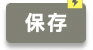

##### 可重用组件

组件1：产品 icon + 欢迎标语，通过 config.scss 配置文件支持更改 icon 和标语

组件2： 用户协议，可通过组件同步所有页面的用户协议

组件3：input 输入框，可以自定义标题（如邮箱）和占位符（如请输入你的邮箱）

组件4：按钮，各种尺寸的按钮，支持更改颜色和大小

组件5：面包屑导航栏，一张 icon 图片和一行导航文字，导航文字可以点击跳转，消息和退出登录

组件6：背景，后期可能可以添加“更改背景”功能

组件7：在用户或者群组主页的标题，表达用户当前处于个人空间还是群组空间

组件8：组件 5 下的一行标语，后期可能可以添加“自定义标语”功能

组件9：单个 project 部分

组件10：project 部分，每行排列 3 个，无限往下滚动，展示了用户或群组所创建的项目个数

组件11：头像框，支持更换图片

组件12：支持文本，日期，tag 和复选框

组件13：

##### 问题

20221119

1. 设置-个人中心进入“信息修改”页面的页面？是点击设置直接进入信息修改页面还是有其他的选项

2. 左侧边栏“我的实验”和“我的课题组”是可以伸缩的还是固定的？
3. Project 图片处理？用户上传还是系统随机分配
4. project 删除按钮？是否可以更改名字？
5. reaction 页面暂无搜索功能？
6. 退出登录页面？无网络连接页面？（一个错误页面的模版）